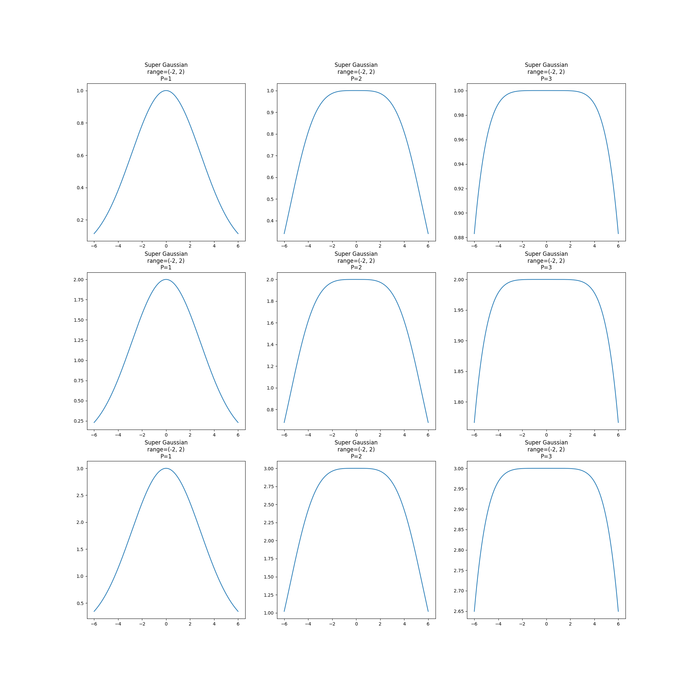

# Super Gaussian Model

A Super Gaussian is a top-flattened gaussian distribution.

This is its formula

$$
f(x, y, z) = \exp\left( \left( \left(\frac{1}{2}\left(\frac{x - x_{0}}{\sigma_{x}}\right)^{2}\right)^{P} + \left(\frac{1}{2}\left(\frac{y - y_{0}}{\sigma_{y}}\right)^{2}\right)^{P} + \left(\frac{1}{2}\left(\frac{z - z_{0}}{\sigma_{z}}\right)^{2}\right)^{P} \right) \right)
$$

On a single dimension you can define a range (A, B). All this region from A to B will be flattened and valuing at 100% and will decrease immediately after.

This figure shows a test on 1 dimension.

The following shows a test on 3 dimensions looking at several slices of the 3rd dimension.

This is a work in progress.

TODO:
- How to control the length of the tail
- How to control the speed at which the probability decreases
