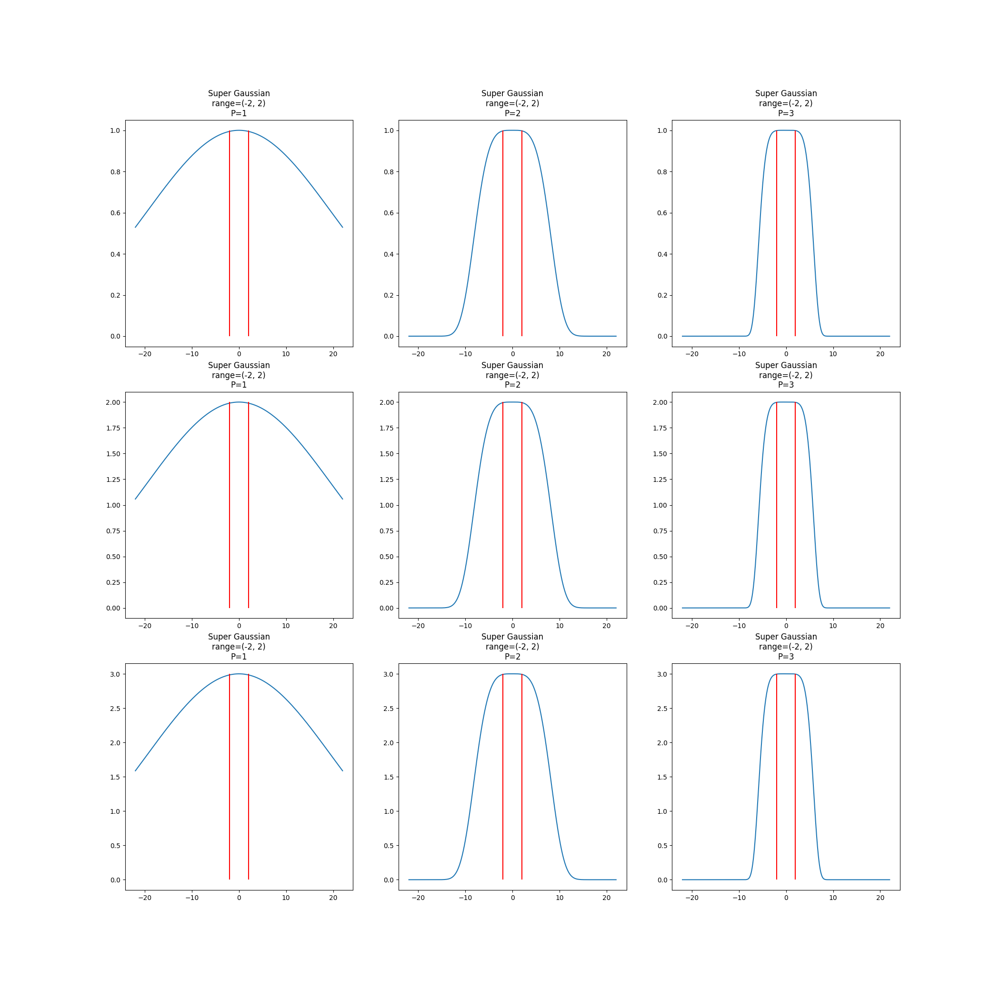

# Super Gaussian Model

A Super Gaussian is a top-flattened gaussian distribution.

$$
f(x, y, z) = \exp\left( \left( \left(\frac{1}{2}\left(\frac{x - x_{0}}{\sigma_{x}}\right)^{2}\right)^{P} + \left(\frac{1}{2}\left(\frac{y - y_{0}}{\sigma_{y}}\right)^{2}\right)^{P} + \left(\frac{1}{2}\left(\frac{z - z_{0}}{\sigma_{z}}\right)^{2}\right)^{P} \right) \right)
$$

Here, $P$ controls the steepness of the function and $x_0$ would be the middle point between the lower and upper bounds we want to define.

We see that $x_{\min}$ and $x_{\max}$ or any other bounds are not defined here. It's actually not well defined, at least very explicitly since there's many values that evaluate to 1. However, we can approximate the value by using a value very close to 1. Say 0.9999 which would translate to 99.99% risk.

Using this value and by solving for just one axis at a time, we can easily find the $\sigma$s that will solve for our ranges.

Example, let's solve for $f(x, y_{0}, z_{0}) = 0.9999$.

$$
-\ln(0.9999) = \left(\frac{(x - x_0)^2}{2(\sigma^{2}_{x})}\right)^{P}
$$

Say then $C = -\ln(0.9999)$ just for simplicity, then the boundaries will be

$$
x_{\max} = x_{0} + \sigma_{x}\sqrt{2\sqrt{C}} 
$$

$$
x_{\min} = x_{0} - \sigma_{x}\sqrt{2\sqrt{C}} 
$$

It is worth mentioning that you can vary the steepness of each axis by changing the $P$ value at each corresponding term.
This figure shows a test on 1 dimension.

The following shows a test on 3 dimensions looking at several slices of the 3rd dimension.

This is a work in progress.

TODO:
- How to control the length of the tail
- How to control the speed at which the probability decreases
